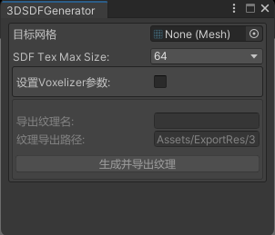

# Unity HWRT Clouds

地平线系列的云的渲染在我看来应该是业界当之无愧的第一，不过从Zero Down到Burning Shores(Forbidden West的DLC)，其渲染的方案也发生了天翻地覆的变化。这对于像我这样后入场的人来说，学习一个云的渲染的成本实在是太高了：当你好不容易完整的复现了整个制作+渲染的管线，别人可能已经搞出一套新的方案了，而这些方案的“升级”还不是简单的加点新功能(很难模块化)。


本文将介绍，如何利用硬件光追管线(Traversal shader还未推出)来做云的渲染(不含完整的modeling与lighting)。同时也给出了一些unity editor中可用的简单小工具：

- 3D Noise生成器(Worley与Perlin-Worley，以后会补上Alligator与Curly-Alligator)
- 模型-3D SDF转换器(基于保守光栅化的体素化+JFA)
- 3D SDF的简易查看器

此外也做了一个简易的分布渲染的“物理”大气层，后续也会将其处理，用于Ambient Scattering的计算。

# 1. Rendering Pipeline

在2015年的[[1]The Real-time Volumetric Cloudscapes of Horizon: Zero Dawn](https://advances.realtimerendering.com/s2015/index.html)中，Andrew提到了Voxel Clouds的想法，但考虑到各种开销最终放弃了这个方案，而有意思的是到了Burning Shores，Andrew他们却又重新启用了Voxel Clouds(时代变了，硬件提升了太多了)。看到Voxel Clouds的可行性后我就想到了一个办法，把Clouds的渲染拆分为Cloud的渲染与Instances的渲染(本文的重点是Instances的渲染)，这样的话Cloud在modeling与lighting上的升级就不会对整体有特别大的影响了(更加模块化了)。

对于光追云，我们需要面对的最重要的问题是：云的渲染的重要工具是Ray Marching，其采样点是由近及远的，而Ray Tracing在BVH中“搜索”的过程，呈现出来的是更贴近于由远及近的(只是一个大致趋势，实际上并无准确的排序)。当然，这点在未来推出了[traversal shader](https://microsoft.github.io/DirectX-Specs/d3d/Raytracing.html#traversal-shaders)之后就不是一个问题了(这也是为什么我们应该将Clouds分为Cloud+Instances, 等traversal shader出了之后只需升级Instances的部分即可)，在那以后也一定会有厂商用硬件光追来做云的。

## 1.1  AABB的类型

虽说我们渲染的是云，但实际中AABB所围成的区域并不就只能代表云，本文AABB可表示的对象有如下类型：

- 云
  - 程序化的云：一般的云，受天气系统影响的云
  - 自定义的云：特殊的云，比如Forbidden West中的anvil cloud(风暴鸟所在的区域存在的云)
- 减集：本质上就是遮罩，可以用于制作云中的“隧道”(这里更多用于动态的，“静态”的可以通过自定义的云的SDF、density来实现)：比如飞行器从云中穿过，产生“隧道”。
- 无像光源：闪电、陨石等光源。与一般的光源不同的是，我们只利用其位置等信息计算这类光源对云的散射的影响，而不直接(在HWRT Clouds管线里)绘制光源。因此这类光源的AABB应当是其所影响的范围的AABB。

在项目中，我们令程序化的云的上限为$2^{14}=16384$(理论上是足够了的)，自定义的云+减集+无像光源的总数上限为$2^{10}=1024$，因此AABB的总数不超过$2^{15}$。

> [!NOTE]
>
> 对用不到的AABB只需设Min, Max为0即可。

## 1.2 Ray Payload

我们定义的`RayPayload`的结构如下：

```glsl
struct RayPayload
{
	float4 color;
	float depth;
    uint rayState;
    uint lightMaskIndex;
    uint clouds0DisIndex;
    uint clouds1DisIndex;
    uint clouds2DisIndex;
    uint clouds3DisIndex;
    uint cloudRange0;
};
```

其中

- `color`：
  - xyz：最终得到的颜色，可能是云的颜色，也可能是天空盒的颜色
  - w：transmittance，不过我们在demo里用的是density来代替
- `depth`：当transmittance小于一定阈值时(在demo里是density达到一定阈值后)，我们认为当前采样点的深度是云的深度。当然，为了统一性(方便换算)，记录的最好是eye space的深度。
- `needSecondaryRay`：在当相机在云层中，射线朝下(方向的`.y<0`时)存在穿过所有相交的AABB并接触到需要反射的点情况，这时候就需要通知射线需要额外的额外`TraceRay()`(不过这不是必须的，因为在miss shader中也可以用`TraceRay()`的)。
- `lightMaskIndex`：前16位表示最近的有效无像光源的索引, 后16位表示最近的有效减集的索引(在项目中以及本文中，我们说的第0位是最高有效位而非最低有效位)。解压索引后，如果`&0x00008000`为1，那么我们认为不受无像光源或是减集的影响，也即初始值为`0x80008000`(这也是因为我们AABB的对象的总数不超过$2^{15}$)。
- `cloudsnDisIndex`(n=0,1,2,3)：表示离相机最近的第1,2,3,4个AABB类型为云的AABB的索引以及其近表面的距离(以m为单位的大致的距离)。前16位表示云的AABB的近表面的距离, 后16位表示最近的云的索引(距离在“前”的好处是可以直接比较大小, 值大的距离远, 值小的距离近，并且理论上相机到目标的距离不会超过$2^{16}-1$，因为相机的远裁剪面有10km就以及很离谱了)。
- `cloudRange0`：最近的云的范围(近表面的距离与远表面的距离)，主要用于判断当前的检测的减集或是无像光源是否是“最近”的且“有效”的，如果是则替换lightMaskIndex中对应的索引。

> [!NOTE]
>
> 为什么需要记录深度？甚至可能需要导出深度？如果仅考虑相机直射到云的射线，我们可以要求其TMax为通过深度图读出来的深度转化的Eye space下的深度值。但是我们这里允许相机通过Normal+Smoothness来得到需要“镜面”反射的区域，比如水面，因此在视差下无法仅通过Geometry的深度图来设置射线的TMax。此外我们期望在渲染完云之后再用SSCS(屏幕空间接触阴影)来做对云的阴影(当然，我们这里没实现这个效果)，这就也需要云的深度图。
>

## 1.3 Tracing

在intersection shader中我们利用Ray-AABB检测得到射线起点到AABB的近表面与远表面的距离，然后记录到我们自定义的结构`CloudAttributeData`里(demo里我们把两个距离压缩到一个`uint`里)，并`ReportHit()`，其中参数`THit`需要用到远表面的距离(这样才能保证所有可能相交的AABB在循环里都会被命中检查一遍)。

然后在anyhit shader中利用当前AABB的属性来更新`RayPayload`，并都`IgnoreHit()`，这样最终我们不会进入closesthit shader，而会进入miss shader。我们只需在miss shader中ray marching最近的(包括可能的第二、第三、第四近的)AABB即可(也就是在Cloud的渲染)。

<figure><figcaption>Number of Ray-AABB Intersections</figcaption></figure>

> [!NOTE]
>
> 虽然只考虑最近的几个AABB，总是存在“错误”的可能性(比如很多个相同大小的AABB在一条直线上，那么在一些视角下后面的可能就不会被渲染了)，但是最对于一般的场景，考虑4个最近的AABB已经是足够的了。


## 1.4 渲染结果

当前只做了Instance的渲染，Cloud的渲染是用SDF做density(代替transmittance)来临时替代的。等后续做了density的生成器后再考虑Cloud的渲染。

<figure><figcaption>Ricci</figcaption></figure>

<figure><figcaption>地面反射</figcaption></figure>

<figure><figcaption>"云层"中向下看与反射的二次射线</figcaption></figure>

# 2 Editor工具

## 2.1 3D Noise生成器

通过顶部菜单栏：`ACloud/Noise/Noise3DGenerator`打开


当前仅提供了Worley与Perlin-Worley两种噪音的选项。

> [!NOTE]
>
> 当前未提供输出压缩格式的选项，这个还是比较好实现的，只需利用`EditorUtility.CompressTexture()`来压缩即可。不过在生成的过程中最好用异步回读，而这要么需要用`EditorCoroutines`这个包，要么需要自己实现一个类似的功能(我还是倾向于以后找时间抄一个来执行Editor中的协程)。

## 2.2 3D SDF生成器

通过顶部菜单栏：`ACloud/SDF/3DSDFGenerator`打开



我们允许生成的最大的SDF的尺寸为$128\times128\times128$的，勾选设置Voxelizer参数来控制网格包围盒与生成SDF时的“边界”的相对距离。

当前SDF的生成是利用正交投影下的保守光栅化与JFA(更准确的是1+JFA)实现的。因此对于一些三角形在正交投影下退化为线的情况是会存在问题的，比如一个立方体的SDF生成，不过考虑到一般云的形状不会出现这种三角形，当前的方案也是足够用的了。

当然，如果云存在隧道，那么当前体素化的方案是不够严谨的，需要额外更准确的体素化方案。

## 2.3 3DSDF查看器

可以通过顶部菜单栏打开，不过我们提供了更方便的方案：双击3D Texture的`.asset`文件。


可以通过WASDEQ以及鼠标中键控制相机移动，也可以通过鼠标右键控制相机方向。红色表示ray marching最终离开AABB所需的(次数)开销(值越大代表次数越多)，蓝色表示ray marching最终接触到表面的开销。

# 3 TODO List

除去一些必然要更新升级的功能(更多的噪音、压缩格式等)，未来考虑做如下功能(期望自己不会鸽)

- Cloud的渲染
  - density的生成器。
  - animated cloud的数据生成器：我们不学Nubis3中云的形成与消散的方案来做animated cloud，而是通过更新预生成的运动向量来实现(这样可以有更丰富的表现)。
- 天气系统
  - 更新程序化的云的位置、参数等。
- 完整的天空盒
  - 极光：尝试用[[3]径向分派](https://zznewclear13.github.io/posts/dispatch-compute-shader-in-a-radial-way/)来做(用径向分派的径向模糊性能确实可观，感觉极光也可以)。
  - 银河：需要保证延时摄影时能出现绕地轴旋转的表现效果。
  - 流星：同上，还需要保证高频率的更新(应该需要和银河共用一张纹理，极光与大气层共用一张)。
- Mask
  - 用于表现各类冲击波的Mask。
- 无像光源
  - 实现无像光源作为Secondary Scattering的功能。
  - 无像光源对指定几何体在云内的阴影：这个通常用于间接的表现云层中存在某些物体(比如云层上的闪电透过云照出在云层上的怪物)。
- 后处理
  - SSCS：做云层与云层以及几何体之间的阴影。
  - God Ray：这里就不适合再用正交相机做阴影然后ray marching了，可以结合径向分派来做。不过我也想试试别的方案。

# References

[[1]The Real-time Volumetric Cloudscapes of Horizon: Zero Dawn](https://advances.realtimerendering.com/s2015/index.html)

[[2]Nubis3: Methods (and madness) to model and render immersive real-time voxel-based clouds](https://advances.realtimerendering.com/s2023/index.html)

[[3]径向分派Compute Shader | ZZNEWCLEAR13](https://zznewclear13.github.io/posts/dispatch-compute-shader-in-a-radial-way/)
